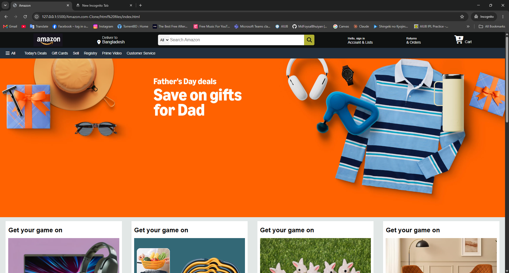

# 🛒 Amazon Clone Website

A responsive **Amazon Homepage Clone** built using **HTML5** and **CSS3**. This project replicates the basic layout and design of the Amazon website to practice frontend web development concepts.

## 📌 Project Overview

This project is a front-end clone of the Amazon homepage. The main goal of this project was to improve skills in **HTML structure**, **CSS styling**, **Flexbox**, and **responsive webpage design**.

The website mimics Amazon’s UI, including the navigation bar, hero section, shopping categories, and footer.

---

## ✨ Features

* 🛍️ Amazon-inspired homepage layout
* 🎨 Styled using pure CSS
* 📱 Responsive design
* 🧭 Navigation bar with menu sections
* 🖼️ Product category cards
* 🦶 Footer section similar to Amazon

---

## 🛠️ Technologies Used

* **HTML5** – Website structure
* **CSS3** – Styling and layout

---

## 📂 Project Structure

```bash
Amazon-Clone/
│── index.html
│── style.css
│── images/
│   ├── hero-image.jpg
│   ├── amazon-logo.png
│   └── other-assets
│── README.md
```

---

## 🚀 How to Run the Project

1. Clone this repository:

```bash
git clone https://github.com/your-username/amazon-clone.git
```

2. Open the project folder.

3. Run `index.html` in your browser.

---

## 📸 Preview

Add your project screenshot here:

```md

```

---

## 📖 What I Learned

Through this project, I practiced:

* HTML semantic structure
* CSS Flexbox
* CSS positioning
* Responsive layout design
* Website cloning techniques
* UI styling and alignment

---

## 🎯 Future Improvements

* Add JavaScript functionality
* Make the website fully responsive
* Add product interactions
* Improve animations and transitions

---

## 👨‍💻 Author

**Ifti Ahmed**

This project was built for learning and practicing frontend web development.
